# FoodScanner — captures d'écran par parcours

Captures réelles (simulateur iPhone 17 Pro), classées par écran/état du parcours utilisateur, thème clair et sombre côte à côte. Chemins relatifs à `screenshots/`.

## 1 · Onboarding

Premier lancement, avant toute autorisation caméra (`OnboardingView`).

| Clair | Sombre |
|---|---|
| 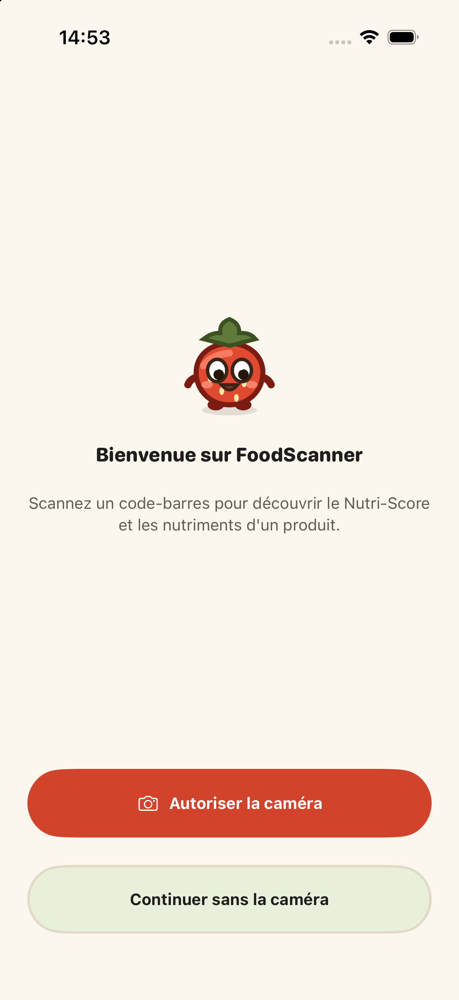 | 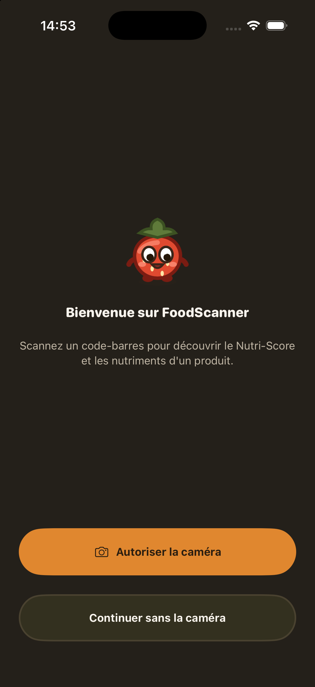 |

## 2 · Scanner

Onglet par défaut au lancement suivant (`ScannerScreenView`). Un seul écran, plusieurs états superposés selon `model.banner` et `showsKeypad`.

### 2.1 — Repos (pas de bannière, pavé fermé)

| Clair | Sombre |
|---|---|
| 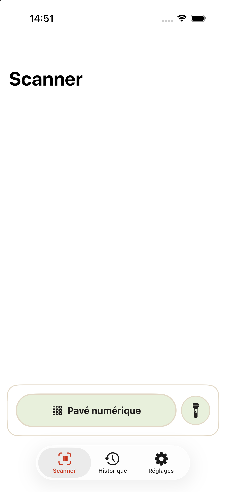 | 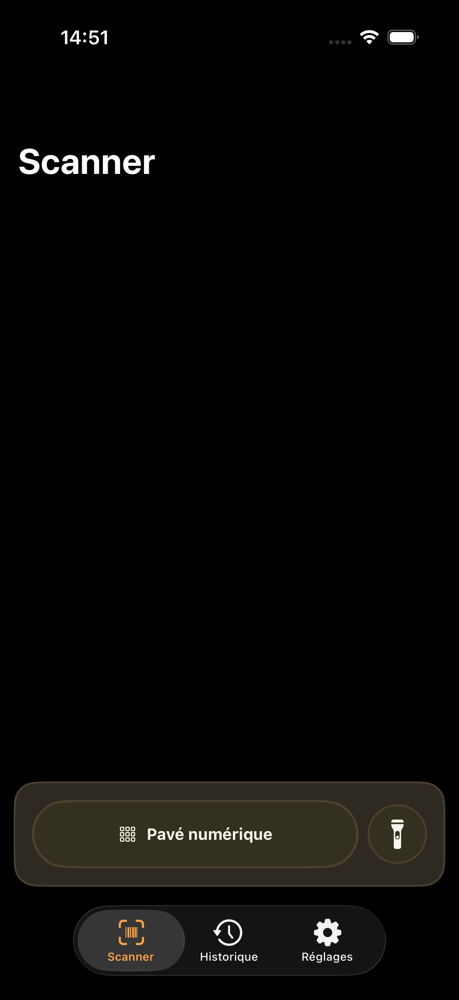 |

### 2.2 — Pavé numérique ouvert, champ vide

`FSBarcodeField` affiche un exemple de code en placeholder ; le bouton « Chercher ce produit » reste désactivé (opacité réduite) tant qu'aucun code n'est saisi.

| Clair | Sombre |
|---|---|
| 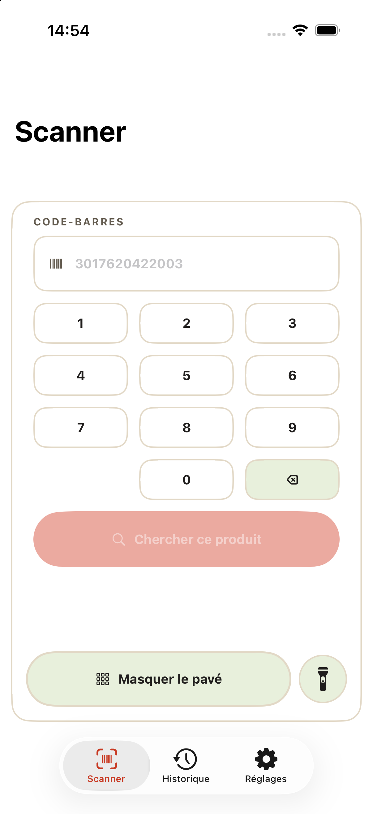 | 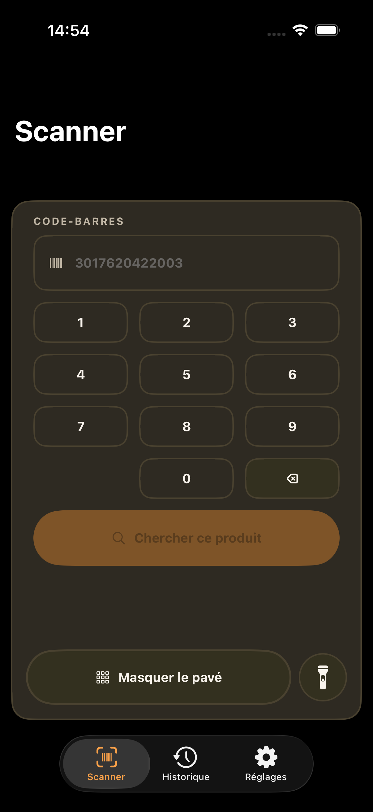 |

### 2.3 — Pavé numérique, code invalide

Code trop court (`65558`) : bouton d'effacement (×) dans le champ, message d'erreur inline (icône + texte accent) : « Un code-barres compte entre 8 et 14 chiffres. »

| Clair | Sombre |
|---|---|
| 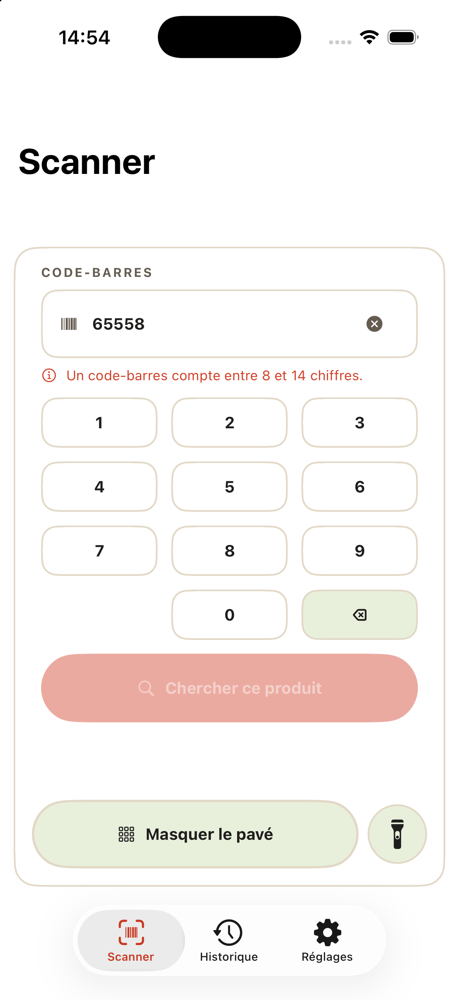 | 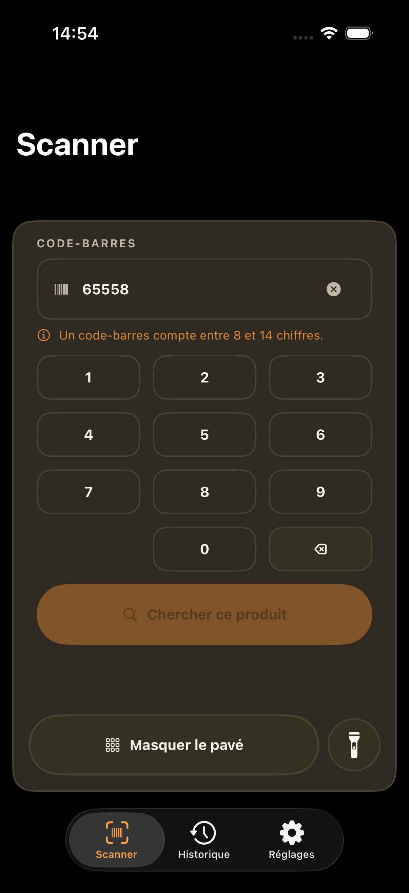 |

### 2.4 — Pavé numérique, champ actif + bannière « introuvable »

Champ avec le focus (liseré épaissi + curseur), superposé à la bannière `FSScanStatusBanner(.notFound)` du scan précédent.

| Clair | Sombre |
|---|---|
| 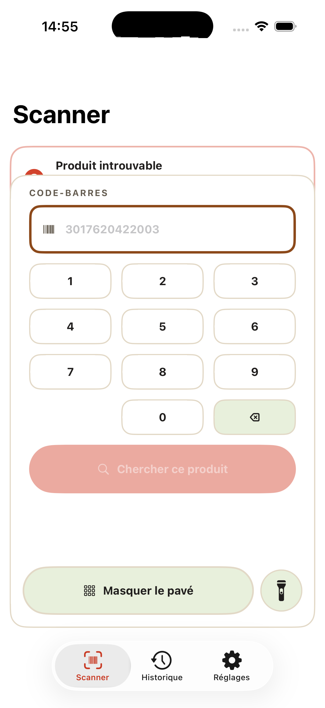 | 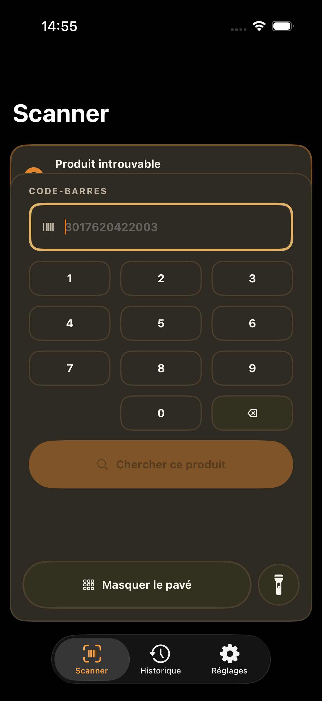 |

### 2.5 — Bannière « produit introuvable »

`FSScanStatusBanner(.notFound)` — pastille orange « ? », liseré accent. « Ce code n'existe pas encore dans la base. Vous pouvez l'ajouter. »

| Clair | Sombre |
|---|---|
| 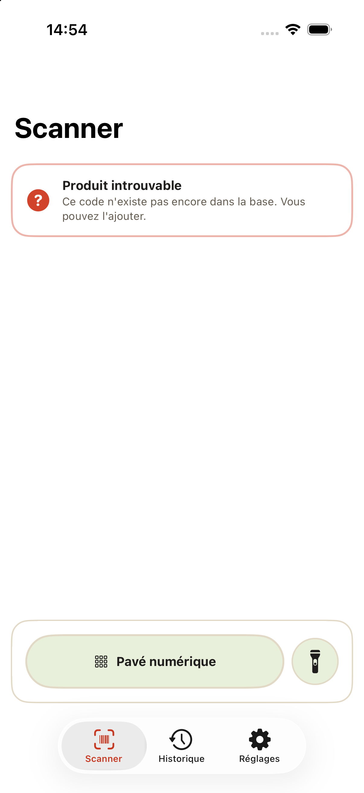 | 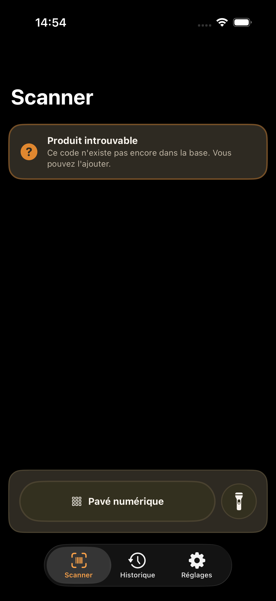 |

### 2.6 — Bannière « produit trouvé »

`FSScanStatusBanner(.found)` — pastille verte ✓, liseré `fsLeaf`. Tapable pour ouvrir la fiche produit.

| Clair | Sombre |
|---|---|
| 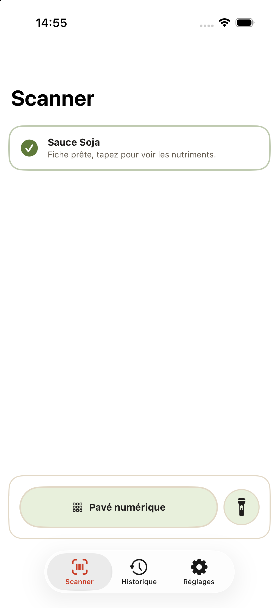 | 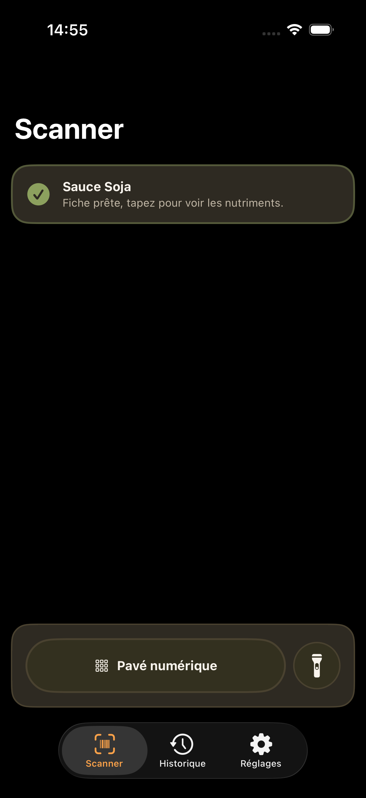 |

## 3 · Fiche produit (Nutriments)

Poussée depuis le Scanner ou l'Historique (`ProductDetailScreenView`). Deux captures par thème : le haut de l'écran, puis le bas après défilement (`FSSceneFooter(.laboratory)`, sous la barre d'onglets flottante).

### 3.1 — Haut : carte produit, échelle Nutri-Score, nutriments

| Clair | Sombre |
|---|---|
| 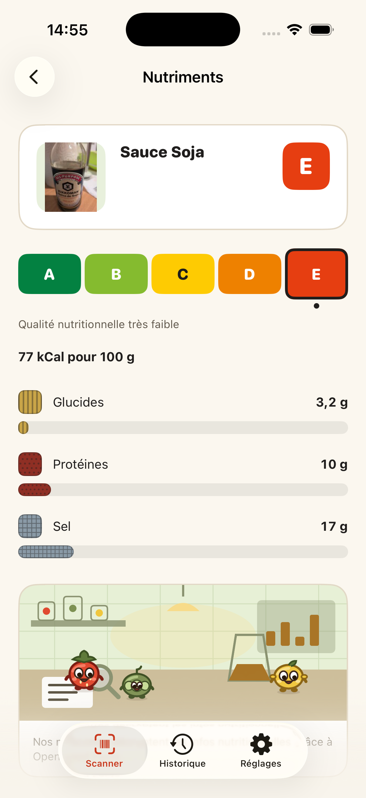 | 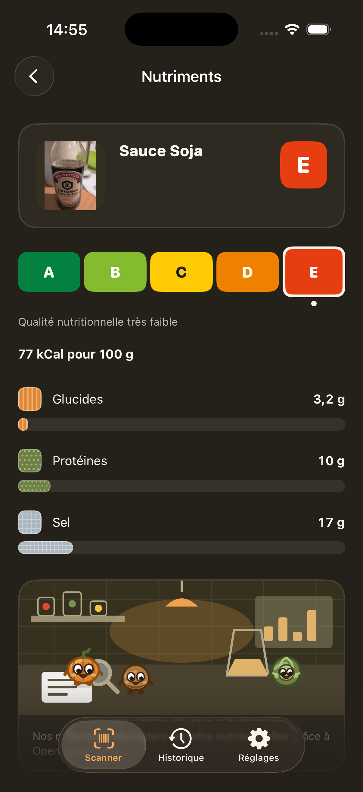 |

### 3.2 — Bas : saynète laboratoire + légende

| Clair | Sombre |
|---|---|
| 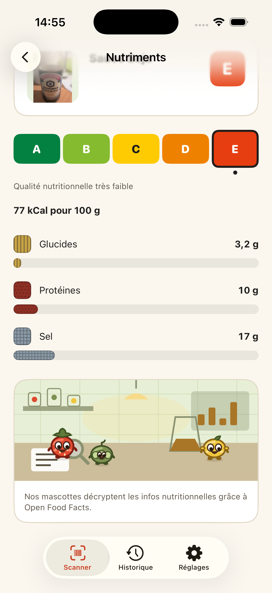 | 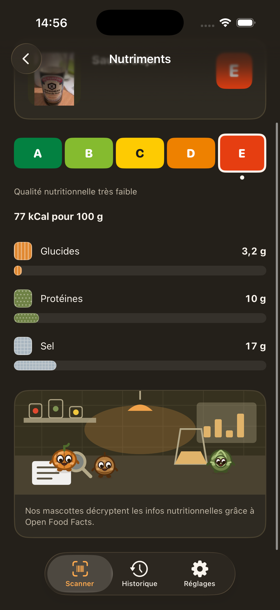 |

## 4 · Historique

`HistoryScreenView` — liste des produits déjà consultés + `FSSceneFooter(.picnic)`.

### 4.1 — Vide

| Clair |
|---|
| 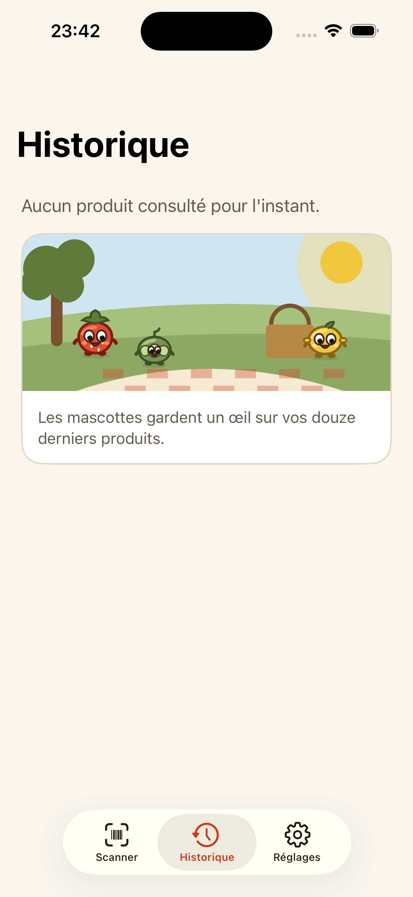 |

### 4.2 — Avec un produit consulté

| Clair | Sombre |
|---|---|
|  | 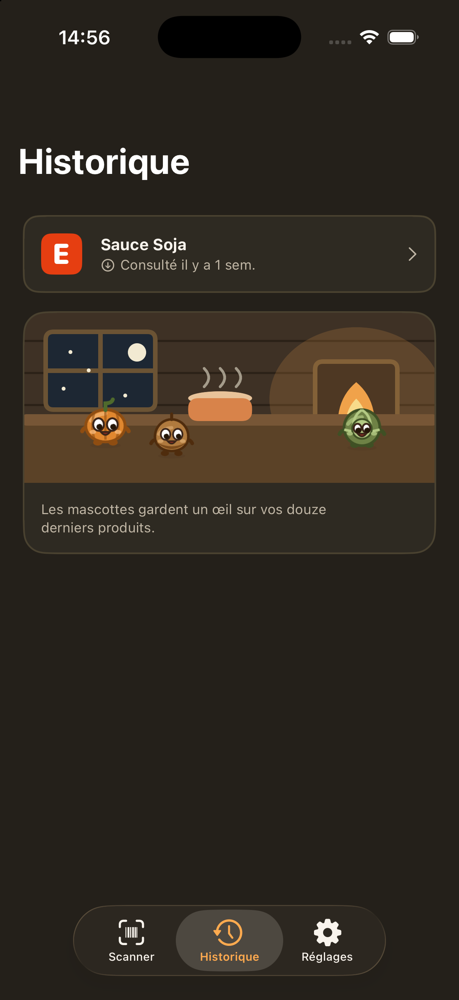 |

## 5 · Réglages

`SettingsScreenView` — contraste (statut système lecture seule), réduction des animations, taille du texte.

| Clair | Sombre |
|---|---|
|  | 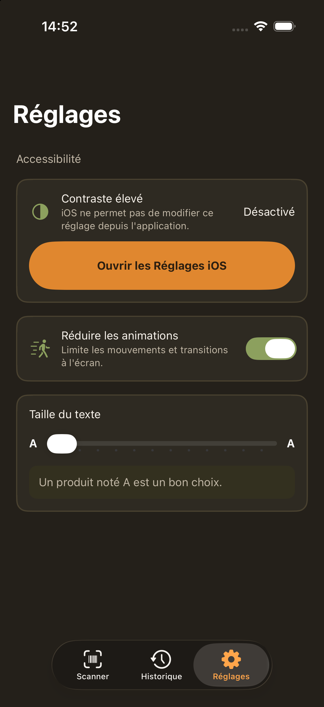 |

---

`screenshots/settings-accessibility.png` (09/02) n'est pas repris ci-dessus : il montre une ancienne version de l'écran où « Contraste élevé » était un interrupteur actionnable, ce qui ne correspond plus au code actuel (statut système en lecture seule, voir §5). À supprimer ou reprendre si une nouvelle capture est faite dans cet état.
