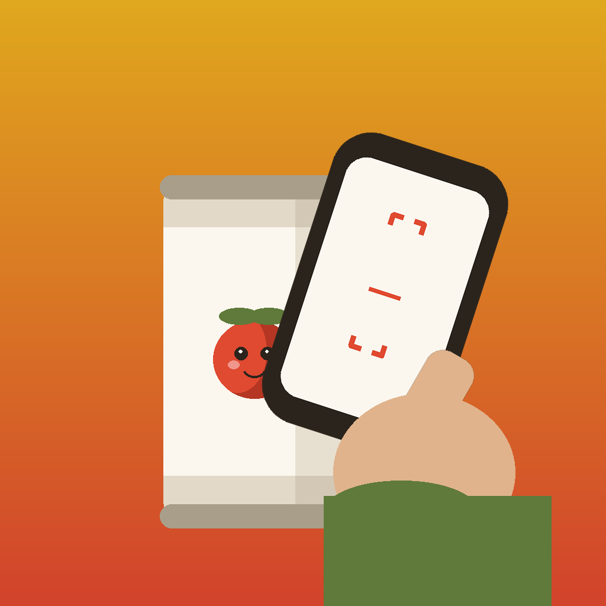
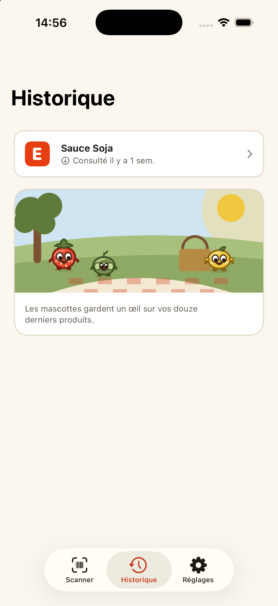
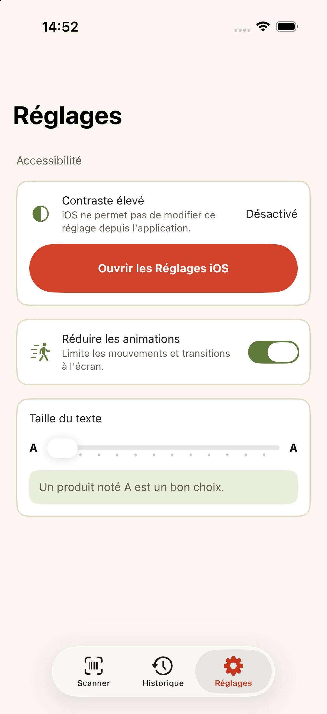

# FoodScanner

FoodScanner is a mobile app for iPhone that lets you scan the barcode on a food package (or type it in by hand) and instantly see nutrition information about that product, like calories, a Nutri-Score badge, and a nutrient breakdown shown as proportion bars. It fetches this information from an online food database, and it remembers products you've already looked up so you can see them again even without an internet connection.

The app is built with Swift and SwiftUI, driven by the local `FoodScannerUI` design-system package (tokens, atoms, molecules), on top of a small set of "Manager" services (`WebServiceManager`, `ParserManager`, `CacheManager`, `ReachabilityManager`, `NetworkActivityManager`, `ErrorManager`, `ImageCacheManager`, `SystemAccessibilityManager`) that are wired together by a single composition root, `InjectionManager`, and handed to consumers behind protocols rather than through singletons. Each screen has its own `ObservableObject` view model (`<Screen>ViewModel`) exposing `@Published` state and `async` methods, with its services constructor-injected. Navigation is a pure SwiftUI `TabView` root (`RootView`, three tabs: Scanner / Historique / Réglages) — no `UIHostingController`/`UINavigationController` anywhere. The Scanner tab runs through a `Coordinator` + `Router` that owns its `NavigationStack`; History still owns a local `NavigationPath`. Barcode data flows from `ScannerScreenView` through `ScannerViewModel`, `WebServiceManager` (Open Food Facts API, `async throws`), and `ParserManager` (JSON decoding into `Codable`/`Sendable` structs), before `CacheManager` — an `actor` — persists it as Realm objects (`Food`/`Nutrient`) and the app navigates to the product detail screen; on network or parse failure the app falls back to the local Realm cache. Text size and reduce-animations preferences chosen in Réglages propagate app-wide (`Extensions/AppAccessibilitySettings.swift`), applied at each tab's hosting-controller root rather than staying local to the Settings screen. Dependencies (Realm, FoodScannerUI) are managed via Swift Package Manager.

- Deployment target: iOS 17.0
- Dependencies are managed via **Swift Package Manager** (resolved by the `FoodScanner.xcodeproj`, not the workspace).
- Concurrency is Swift Concurrency (`async`/`await`, actors) throughout the Managers layer — no GCD/completion-handler code remains there.

## Linting and code generation

- **SwiftLint** is wired in as an SPM build tool plugin (`SwiftLintPlugin`, package `realm/SwiftLint`) on the `FoodScanner` target, so it lints automatically on every build in Xcode using the ruleset in `.swiftlint.yml`. The first time you build after pulling this, Xcode may prompt you to approve running the plugin ("Trust & Enable") — this is expected. You can also run it manually from the command line with `swiftlint` (if installed, e.g. via `brew install swiftlint`) from the repo root, which reads the same `.swiftlint.yml`.
- **SwiftGen** generates type-safe accessors for assets (see `swiftgen.yml`) into `FoodScanner/Generated/` (git-ignored, not committed). It runs automatically via a "SwiftGen" Run Script build phase on the `FoodScanner` target if a `swiftgen` binary is found (checked via a locally SPM-resolved plugin artifact, `PATH`, Homebrew, or Mint); if not found the script logs a warning and skips generation instead of failing the build. To run it manually, install SwiftGen (`brew install swiftgen`) and run `swiftgen config run --config swiftgen.yml` from the repo root.

## Screenshots

Real captures, light and dark theme, sorted by screen — see [`Docs/user-journey.md`](Docs/user-journey.md) for the full set (onboarding, every Scanner state, product detail, history, settings). A couple of highlights:

| History | Settings |
| --- | --- |
|  |  |

Both screens use the `FoodScannerUI` design system (≥19 pt text, ≥44 pt tap targets, Dynamic Type to AX5) and the seasonal spring-summer palette. The text-size and reduce-animations choices in Réglages propagate app-wide.

## Further reading

- [`Docs/design-system-reference.dc.html`](Docs/design-system-reference.dc.html) — the `FoodScannerUI` design-system reference (tokens, Nutri-Score, patterns, mascots).
- [`Docs/accessibility-reference.dc.html`](Docs/accessibility-reference.dc.html) — how the app's accessibility features actually behave today (VoiceOver, contrast, Dynamic Type).
- [`Docs/user-journey.md`](Docs/user-journey.md) — every screen/state, light and dark, in order of the user journey.
